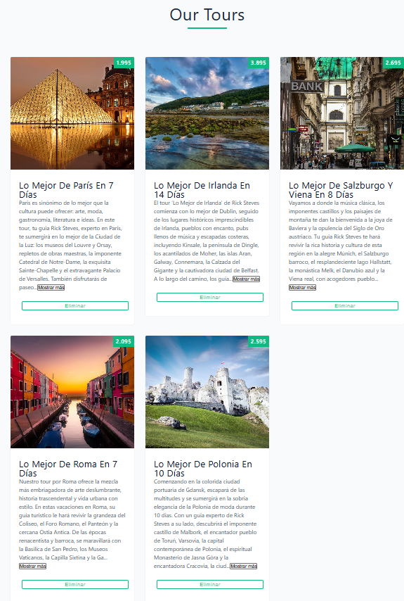

# Tours Project 🗺️

  
  
   

Este proyecto es un ejercicio en **React** donde se muestra una lista de tours que se pueden eliminar individualmente. Contiene funciones como *ver mas* - *ver menos* que se activan dependiendo el estado del componente. Tambien al eliminar todos los componentes aparece un boton para retornar todos los componentes iniciales. Tiene un numero predeterminado de caracteres que pueden aparecer en su descripcion como vista previa de esa informacion. 
El objetivo es practicar **componentes**, **props**, **state** y el hook **useEffect**.

---

## Tecnologías utilizadas
- React con Vite
- JavaScript (ES6+)
- CSS básico
- Hooks: useState y useEffect

---

## Funcionalidades
- Simulación de carga de datos desde una API con `setTimeout`.
- Renderizado dinámico de una lista de tours desde un archivo `data.js`.
- Posibilidad de eliminar tours individualmente con un botón.
- Componente principal `App` que gestiona el estado global.
- Componentes separados para mantener la aplicación modular: `Tours` y `Tour`.

---

