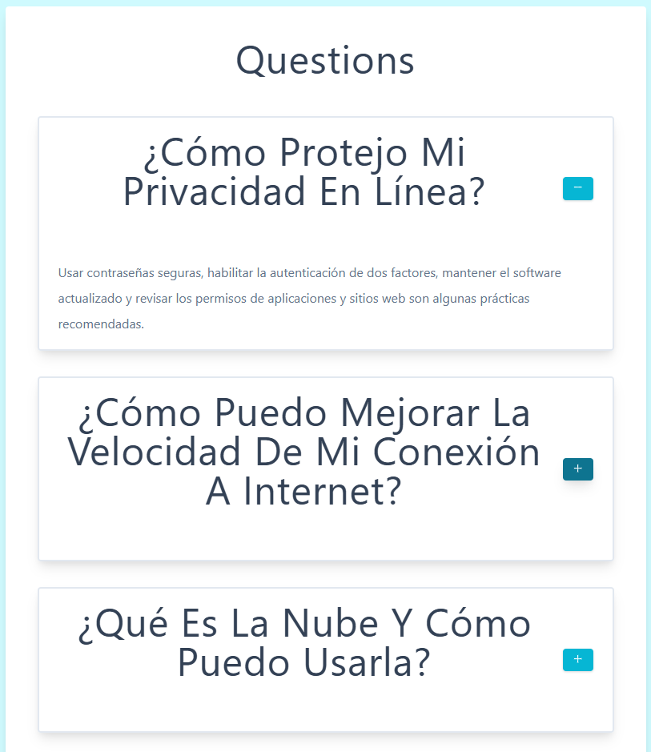
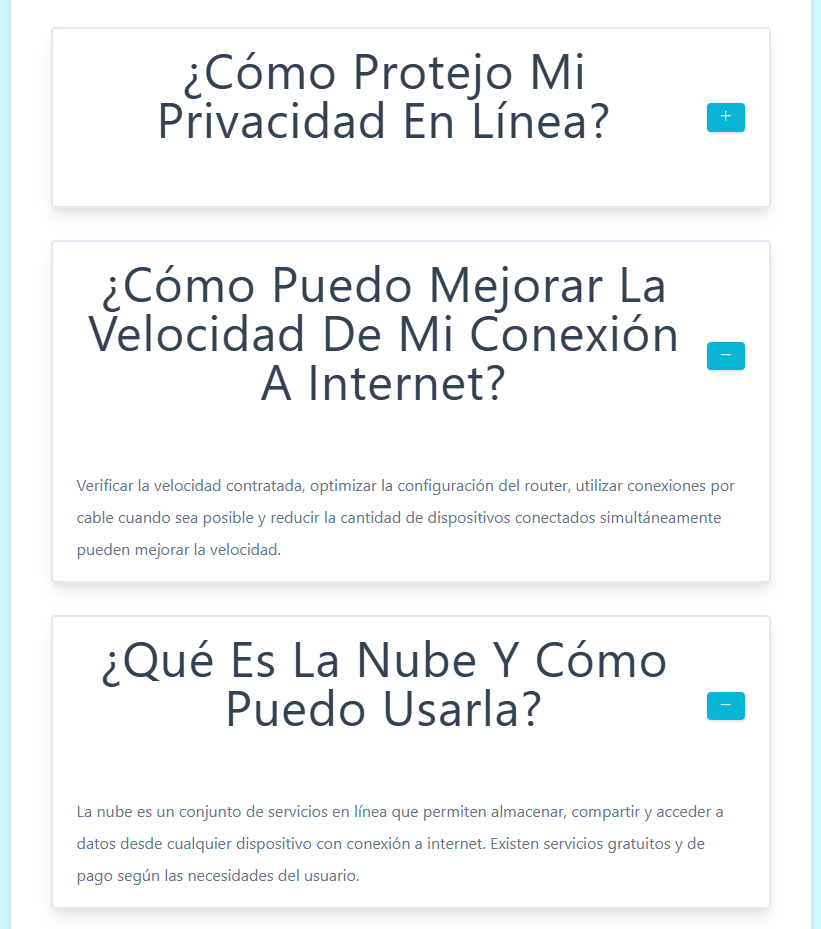

# Questions Project ❓

  
  

Este proyecto es un ejercicio en **React** que muestra una lista de preguntas con la opción de expandir o contraer la respuesta.  
El objetivo es practicar **componentes**, **props**, **state** y el uso de íconos con `react-icons`.

---

## Tecnologías utilizadas
- React con Vite
- JavaScript (ES6+)
- CSS básico
- Librería [react-icons](https://react-icons.github.io/react-icons/) para los botones (+ / -)
- Hooks: useState

---

## Funcionalidades
- Renderizado dinámico de preguntas desde un array de objetos.
- Cada pregunta puede expandirse o contraerse individualmente.
- Íconos que cambian de `+` a `-` dependiendo del estado.
- Componentes separados:
  - `Question`: lista de todas las preguntas.
  - `SingleQuestion`: pregunta individual con su estado propio.
