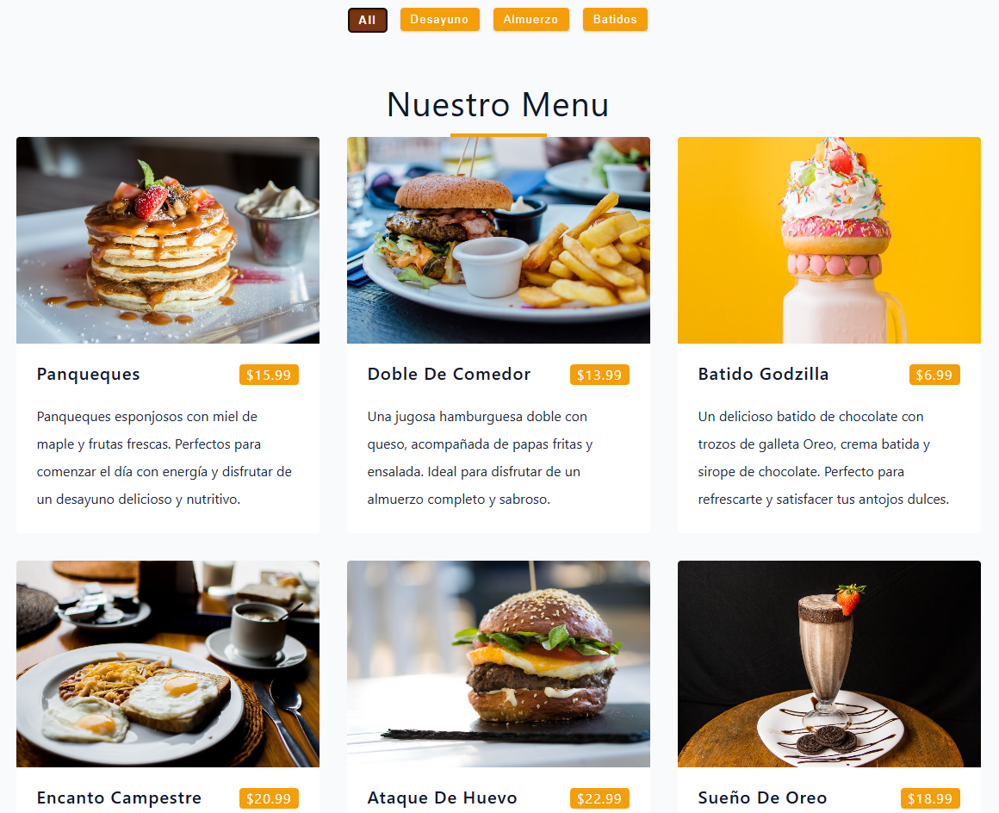
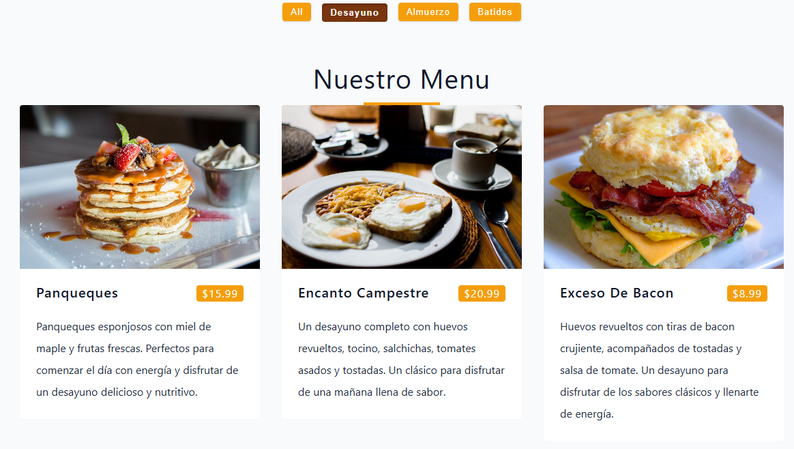
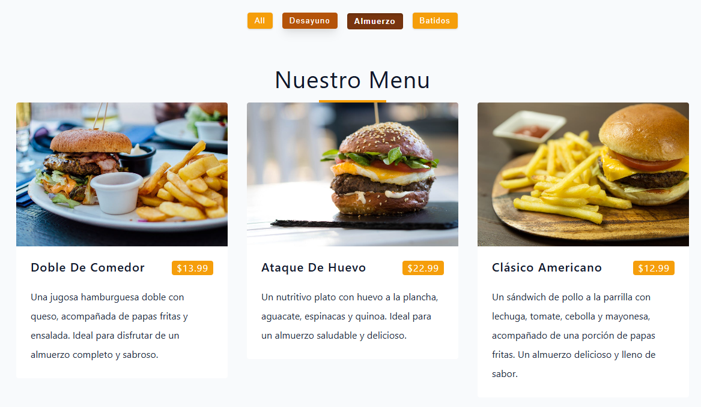
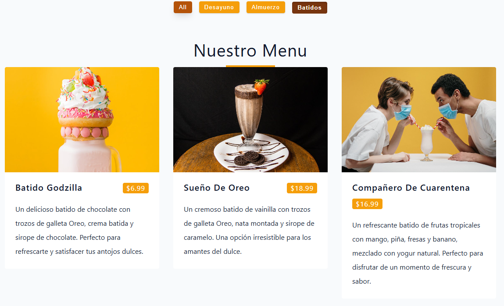

🍽️ Menu Filter React App

🍽️ React Menu App

Una aplicación web interactiva desarrollada en React.js que muestra un menú de platos y permite filtrarlos por categorías. Este proyecto forma parte de mis prácticas en React para mejorar mis habilidades con componentes, props, estado, hooks y estilos CSS personalizados.

📖 Descripción

La aplicación permite visualizar un menú de diferentes comidas (desayuno, almuerzo, cena, etc.) y filtrarlas dinámicamente con botones que representan cada categoría.

Además, se trabajó con diseño responsivo y estilos personalizados en CSS, incluyendo transiciones, cambios de color en botones y efectos visuales que mejoran la experiencia del usuario.

🎯 Objetivos de Aprendizaje

Uso de componentes funcionales en React.
Manejo del estado con useState.
Comunicación entre componentes mediante props.
Filtrado dinámico de datos con map() y filter().
Renderizado condicional en React.
Uso de destructuring y spread operator (...).

Estilos avanzados en CSS3 con hover, active y transiciones.

🛠️ Tecnologías Utilizadas

⚛️ React.js – Biblioteca para construir interfaces.

📜 JavaScript ES6+ – Sintaxis moderna de JavaScript.

🎨 CSS3 – Estilos responsivos y efectos visuales.

🏗️ HTML5 – Estructura semántica.

⚙️ Funcionalidades
🔍 Filtros por Categoría

Botón "All" para mostrar todos los platos.
Botones dinámicos generados a partir de las categorías del menú.
Filtrado instantáneo al hacer clic.

🍕 Visualización de Platos

Cada plato incluye imagen, título, precio y descripción.
Diseño responsive en cuadrícula adaptable (grid).
Presentación clara y ordenada.

🎨 Interfaz Intuitiva y Estilizada

Botones con efecto hover: al pasar el cursor cambian a un tono más oscuro.
Botones con estado activo (active): cambian a un color más fuerte y simulan estar presionados con sombra interna y ligero hundimiento.
Paleta de colores basada en tonos cálidos (naranja/amarillo).
Layout adaptable a diferentes tamaños de pantalla.