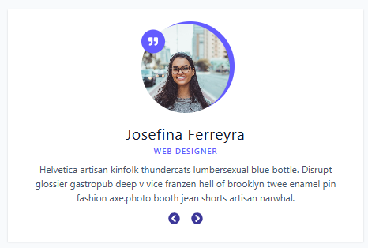
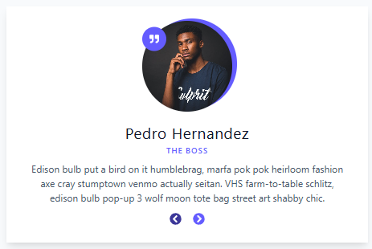

# Reseñas en React 

  
  
  

📌 Descripción

Este proyecto es un ejercicio en React que muestra una lista de reseñas de personas. El usuario puede navegar entre reseñas utilizando botones de siguiente y anterior, todo controlado con estado interno.

El objetivo es reforzar conceptos como componentes, props, state, el manejo de arreglos y el uso de íconos con la librería react-icons.

🛠️ Tecnologías utilizadas

⚛️ React con Vite

📜 JavaScript (ES6+)

🎨 CSS básico para estilos

🔄 Hooks: useState

⭐ React Icons para mejorar la interfaz visual

⚙️ Funcionalidades

Renderizado dinámico de reseñas desde un archivo data.js.

Botones para navegar entre reseñas (siguiente y anterior).

Uso de íconos (FaChevronCircleLeft, FaChevronCircleRight, FaQuoteRight) para una interfaz más atractiva.

Manejo de estado para controlar el índice de la reseña actual.

Estructura modular separando el componente principal y la data.