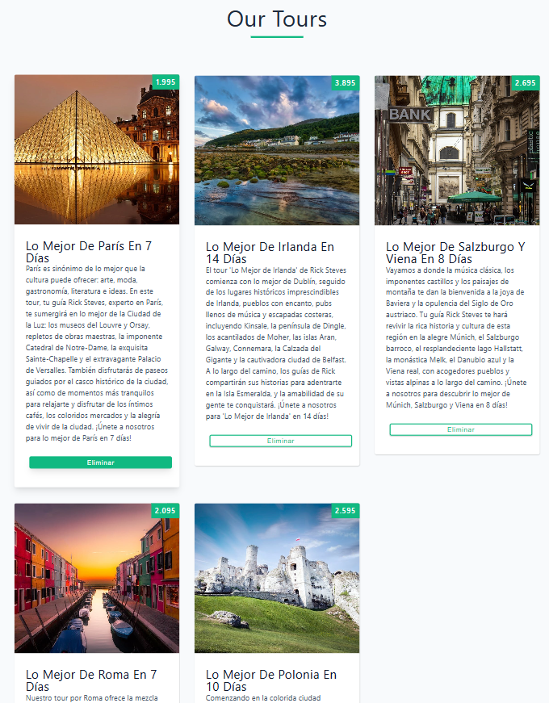
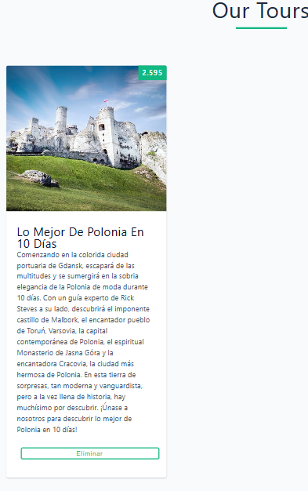

# Tours Project 🗺️

  
  

Este proyecto es un ejercicio en **React** donde se muestra una lista de tours que se pueden eliminar individualmente.  
El objetivo es practicar **componentes**, **props**, **state** y el hook **useEffect**.

---

## Tecnologías utilizadas
- React con Vite
- JavaScript (ES6+)
- CSS básico
- Hooks: useState y useEffect

---

## Funcionalidades
- Simulación de carga de datos desde una API con `setTimeout`.
- Renderizado dinámico de una lista de tours desde un archivo `data.js`.
- Posibilidad de eliminar tours individualmente con un botón.
- Componente principal `App` que gestiona el estado global.
- Componentes separados para mantener la aplicación modular: `Tours` y `Tour`.

---

## Vista previa
Puedes agregar aquí una imagen o captura del proyecto.  
Por ejemplo, si tienes una captura llamada `preview.png` en la raíz del proyecto:

